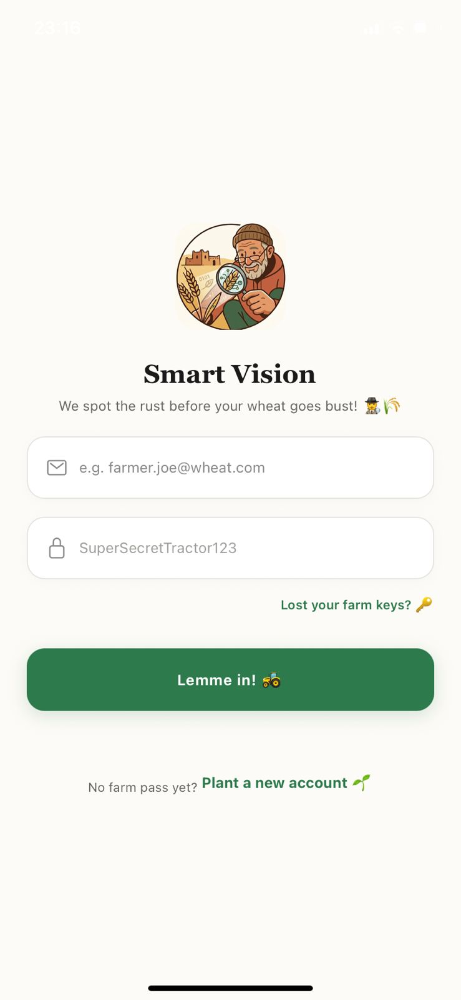
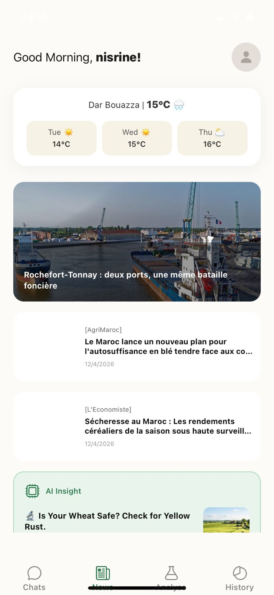
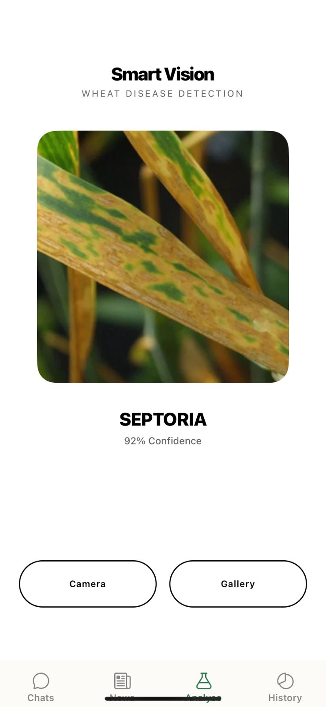
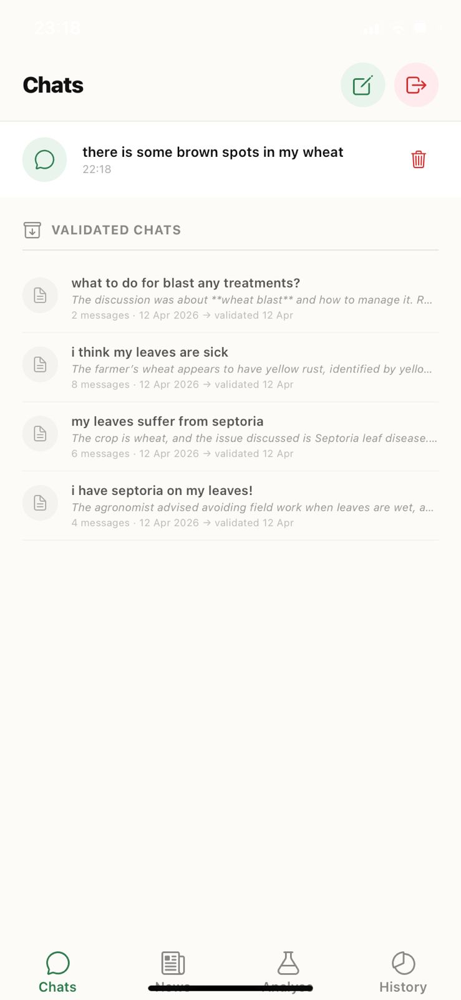
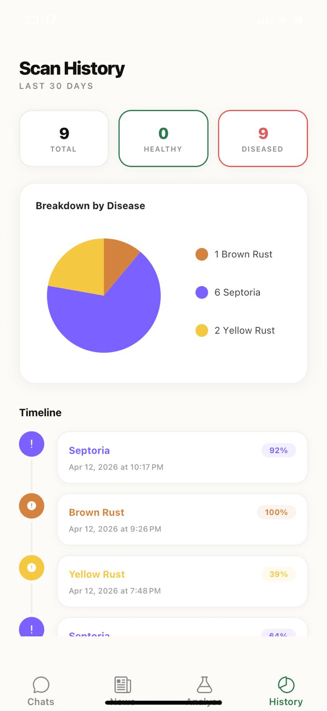

# 🌾 Smart Vision: AI-Powered Wheat Disease Detection


Smart Vision is an agricultural Decision Support System (DSS) designed specifically for Moroccan field conditions. It combines edge-device computer vision with LLM-based reasoning to help farmers identify, track, and treat wheat leaf diseases in real-time.

> **Note to Evaluators:** This is a PFA (Final Year Engineering Project) currently in active development. The core pipeline is fully operational. See the [Engineering Roadmap](#-engineering-roadmap) for a detailed breakdown of what is done and what is planned.

---

## Visual Showcase

| Login | News Dashboard | AI Scan | Chat | History |
| :---: | :---: | :---: | :---: | :---: |
|  |  |  |  |  |

---

## Current Features (MVP)

> **This is an MVP.** The core pipeline (scan → detect → chat → archive) is fully functional, but this is just the beginning. A lot of advanced features are coming.

- **Disease Detection** — Scan wheat crops using your camera. A fine-tuned EfficientNet-B3 model classifies diseases in real time with confidence scoring.
- **Multi-Agent Expert Panel** — Ask any agronomy question and get a unified response synthesized from 4 specialized AI agents (Diagnostician, Treatment Specialist, Agronomist, and Risk Analyst).
- **RAG Knowledge Base** — The AI panel is grounded in official Moroccan agricultural PDFs (e.g., ONCA guidelines, INRA bulletins) using MongoDB Atlas Vector Search, ensuring localized and accurate advice.
- **GPS-Aware Risk Analysis** — The Risk Analyst agent automatically pulls real-time OpenWeather data based on your phone's GPS to assess disease spread conditions.
- **Validated Chat Archive** — Validate and archive important conversations. An AI-generated summary (crop, disease, treatment) is auto-saved for future reference.
- **Scan History & Analytics** — View a timeline of past scans with a pie chart breakdown of Healthy vs. Diseased results over the last 30 days.
- **Agricultural News** — Latest Moroccan wheat and agriculture news in French via GNews.
- **Secure Authentication** — JWT-based login and registration with full password complexity validation.

---

## Model Architecture

The detection pipeline uses a two-tier approach to balance speed and accuracy:

1. **Detection Model:** `EfficientNet-B3` (PyTorch / torchvision) fine-tuned on field-condition wheat imagery.
2. **Multi-Agent Panel:** `GPT-5.4-nano` orchestrates 4 specialized agents concurrently.
3. **Retrieval-Augmented Generation (RAG):** `text-embedding-3-small` creates embeddings for Moroccan agricultural PDFs, queried via MongoDB Atlas Vector Search.

### Disease Classes

| Index | Class |
| :---: | :--- |
| 0 | Blast |
| 1 | Brown Rust |
| 2 | Healthy |
| 3 | Septoria |
| 4 | Yellow Rust |

> **Preprocessing:** `300×300` input, ImageNet normalization stats (`mean=[0.485, 0.456, 0.406]`, `std=[0.229, 0.224, 0.225]`).

---

##  Tech Stack

| Component | Technology |
| :--- | :--- |
| **Mobile Client** | React Native (Expo Router) + Expo Location |
| **API Server** | FastAPI (Python 3.11) |
| **Database & Vector Store** | MongoDB Atlas (Motor Async + Vector Search) |
| **Deep Learning** | PyTorch / torchvision (EfficientNet-B3) |
| **Generative AI & RAG** | OpenAI API (GPT-5.4-nano, text-embedding-3-small), PyPDF |
| **Authentication** | JWT (HS256) |

---

##  Local Setup

### Prerequisites
- Node.js (v18+)
- Python (v3.11+)
- `uv` package manager *(recommended)* or `pip`

### 1. Environment Variables

Create a `.env` file inside `/backend`:

```env
MONGODB_URI=your_atlas_connection_string
JWT_SECRET=your_generated_secret_key
OPENAI_API_KEY=your_openai_key
OPENWEATHER_API_KEY=your_weather_key
GNEWS_API_KEY=your_gnews_key
```

### 2. Backend

```bash
cd backend
uvicorn main:app --host 0.0.0.0 --port 8001 --reload
```

### 3. Frontend

```bash
cd frontend
npm install
npx expo start
```

> **Important:** Update the `HOST` constant in `chats.tsx`, `analyse.tsx`, `history.tsx`, and `index.tsx` to match your local machine's Wi-Fi IP address so that Expo Go can reach the backend.

---

##  Engineering Roadmap

###  Done — MVP Core

| Feature | Status |
| :--- | :---: |
| JWT Authentication & Registration | ✅ Done |
| EfficientNet-B3 Disease Detection | ✅ Done |
| AI Double-Check (Prediction Validation <70%) | ✅ Done |
| Confidence Score Persistence | ✅ Done |
| Multi-Agent Expert Panel (4 Agents) | ✅ Done |
| RAG Knowledge Base (MongoDB Vector Search)| ✅ Done |
| GPS-Aware Weather Tool Integration | ✅ Done |
| Validated Chat Archive (AI Summary) | ✅ Done |
| Read-Only Chat History Viewer | ✅ Done |
| Scan History & Pie Chart Analytics | ✅ Done |
| Weather Dashboard | ✅ Done |
| Agricultural News Feed | ✅ Done |

---

###  In Progress

| Feature | Status |
| :--- | :---: |
| Model v2 — EfficientNet-B0 (Reduced False Positives) |  Training |
| Confidence Thresholding & UX Warning |  Next |
| Backend Modularization (`model_service.py`) |  Next |

---

###  Advanced AI Pipeline (Planned)

| Feature | Description |
| :--- | :--- |
| **Ensemble Model Pipeline** | Combine multiple fine-tuned models (EfficientNet-B3, ResNet50, ViT) and let a meta-agent vote on the final prediction to reduce false positives structurally. |

---

###  Intelligent Dashboards (Planned)

| Feature | Description |
| :--- | :--- |
| **Disease Outbreak Heatmap** | Geo-tag every scan and overlay results on a map of Morocco. If multiple farmers in the same region report the same disease in a short window, generate an automatic regional alert. |
| **Field Health Score** | A composite weekly score per user that aggregates scan results, disease severity, and treatment compliance into a single "field health" metric. |
| **Predictive Risk Forecasting** | Correlate historical scan data with weather patterns (humidity, temperature, rainfall) to predict when a disease outbreak is statistically likely *before* it happens. |
| **Seasonal Trend Analysis** | Year-over-year breakdown of disease prevalence by month and region, giving farmers and agronomists actionable planting/treatment timing insights. |
| **Treatment Efficacy Tracker** | Allow farmers to log follow-up scans after treatment. The dashboard then visualizes whether the disease regressed, stabilized, or worsened. |

---

### Ecosystem & Community Features (Planned)

| Feature | Description |
| :--- | :--- |
| **Offline Scan Queue** | Scans taken in deep fields without connectivity are queued locally and synced to the cloud automatically once a connection is restored. |
| **WhatsApp / Telegram Bot** | Expose the detection pipeline as a chatbot on WhatsApp and Telegram — platforms already widely used by Moroccan farmers — with no app installation required. |
| **Community Disease Reporting** | Crowdsourced outbreak reporting: farmers can flag a disease in their area, contributing to the regional heatmap and alerting their neighbors. |
| **PDF Report Export** | Generate a professional PDF report of a scan session (diagnosis, confidence, treatment recommendation) for insurance claims, agricultural loans, or government subsidy applications. |
| **Multi-Crop Support** | Expand detection beyond wheat to cover barley, maize, and sunflower — the three other major Moroccan cereal crops. |
| **Expert Agronomist Network** | In-app marketplace to connect farmers with certified local agronomists for video consultations triggered by low-confidence or severe detections. |
| **Crop Calendar Integration** | Integrated Moroccan crop calendar: optimal planting, irrigation, and harvest windows by region, automatically adjusted for current-season weather anomalies. |
| **Multi-language UI** | Full support for Arabic (Darija-aware), French, and English to ensure accessibility across all literacy levels. |

---

## Author

**Nisrine Regragui** — [@nisrineregragui](https://github.com/nisrineregragui)

---

*Smart Vision — Built for the field, powered by AI.* 🌱
